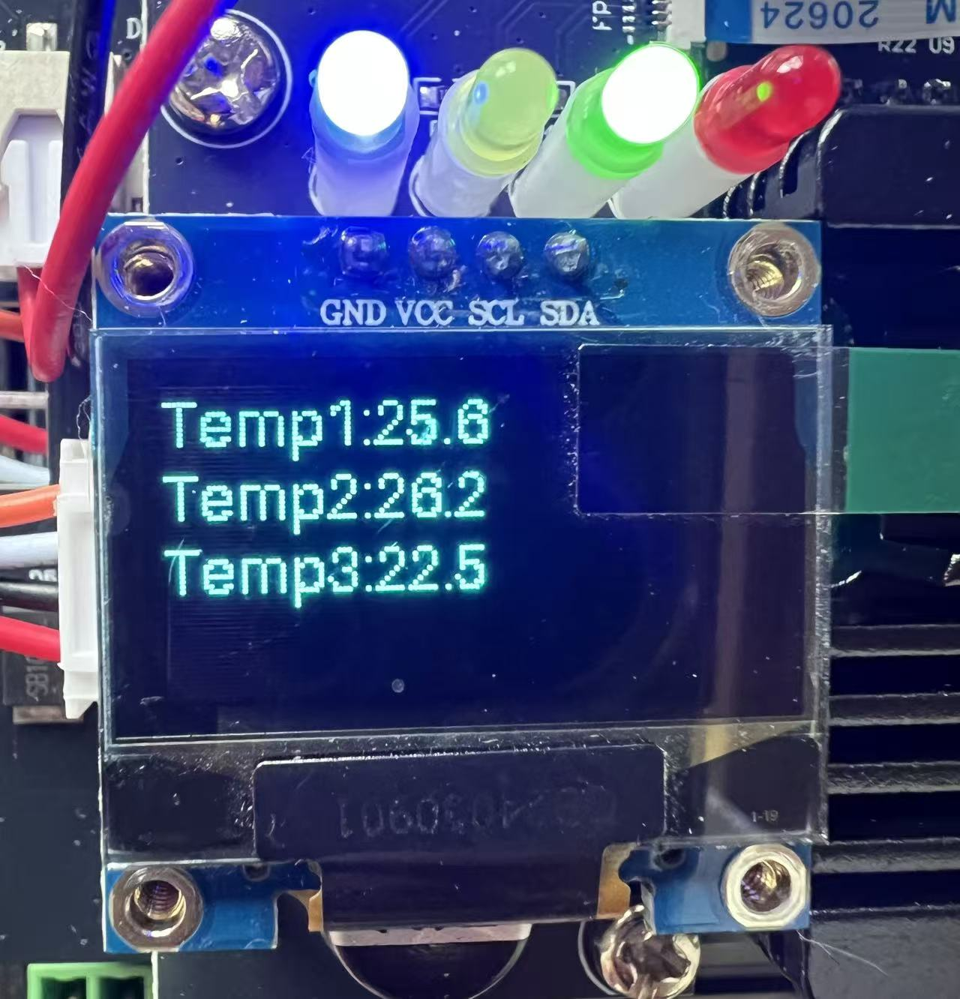
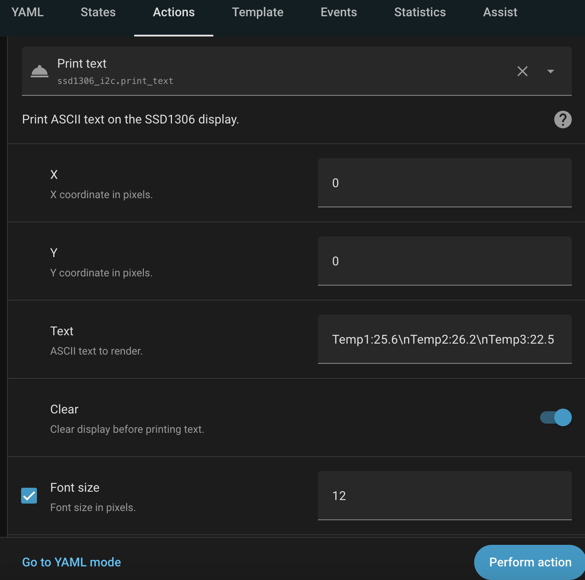

# SSD1306 I2C Display for Home Assistant

A minimal Home Assistant custom integration for SSD1306 I2C displays. This integration allows you to display ASCII text on OLED screens connected via I2C.

## Screenshots




## Installation

### HACS (Recommended)

1. Open HACS in your Home Assistant instance
2. Click on "Integrations"
3. Click the three dots in the top right corner
4. Select "Custom repositories"
5. Add this repository URL: `https://github.com/kincony/hass-ssd1306`
6. Select category: "Integration"
7. Click "Add"
8. Find "SSD1306 I2C Display" in HACS and click "Download"
9. Restart Home Assistant

### Manual Installation

1. Clone or download this repository
2. Copy the `custom_components/ssd1306_i2c` directory into your Home Assistant `custom_components` folder
3. Restart Home Assistant

## Configuration

Add the integration to your `configuration.yaml`. This integration supports multiple displays by providing a list of configurations.

```yaml
ssd1306_i2c:
  - name: "main"
    model: "128x64"
    address: 0x3C
    i2c_bus: 1
    rotate: 0
  - name: "secondary"
    model: "128x32"
    address: 0x3D
    i2c_bus: 1
    rotate: 0
```

### Configuration Variables

| Variable | Type | Default | Description |
| :--- | :--- | :--- | :--- |
| `name` | string | (optional) | Display identifier. If not specified, uses `{i2c_bus}_{address}` (e.g., "1_60"). |
| `model` | string | `128x64` | Display model. Supported: `128x64`, `128x32`, `96x16`, `64x48`, `64x32`. |
| `address` | integer | `0x3C` | I2C address of the display (e.g., `0x3C` or `60`). |
| `i2c_bus` | integer | `1` | I2C bus number. |
| `rotate` | integer | `0` | Rotation of the display. Supported values: `0`, `1`, `2`, `3` (90 degree steps clockwise). |

#### Rotation Values

- `0`: No rotation (0 degrees)
- `1`: 90 degrees clockwise
- `2`: 180 degrees
- `3`: 270 degrees clockwise

## Services

### `ssd1306_i2c.print_text`

Prints ASCII text to the configured display(s).

| Field | Type | Required | Description |
| :--- | :--- | :--- | :--- |
| `x` | integer | Yes | X coordinate in pixels (0-127). |
| `y` | integer | Yes | Y coordinate in pixels (0-63). |
| `text` | string | Yes | Text to render. |
| `clear` | boolean | No | Clear the display before printing. Default: `true`. |
| `font_size` | integer | No | Font size in pixels (8-64). Default: `24`. |
| `display_name` | string | No | Target display name (e.g., "main" or "1_60"). If not specified, prints to all displays. |

#### Service Call Examples

Print to a specific display by name:
```yaml
service: ssd1306_i2c.print_text
data:
  x: 0
  y: 0
  text: "Hello World"
  clear: true
  font_size: 24
  display_name: "main"
```

Print to a specific display by auto-generated name:
```yaml
service: ssd1306_i2c.print_text
data:
  x: 0
  y: 0
  text: "Hello World"
  display_name: "1_60"  # i2c_bus 1, address 0x3C (60 in decimal)
```

Print to all displays (omit `display_name` field):
```yaml
service: ssd1306_i2c.print_text
data:
  x: 0
  y: 0
  text: "Hello World"
  clear: true
  font_size: 24
```

## Limitations

- ASCII only: non-ASCII characters are stripped before rendering.
- YAML-only configuration (no config flow).
